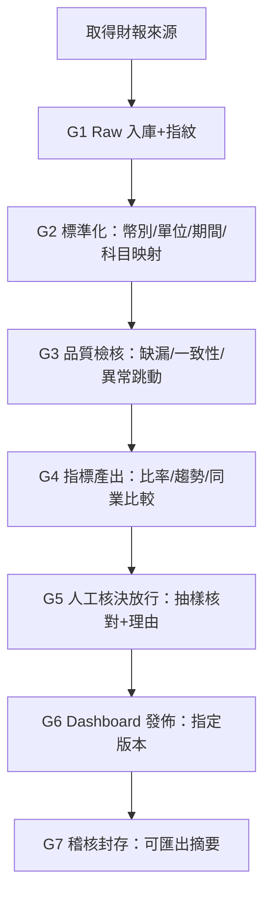

# 流程｜財報分析

本流程採共同 Gate（docs/core/04）。


流程要點（避免走歪）

指標產出前一定先做口徑統一與 DQ

DQ 警告不一定阻擋，但必須在 G5 由審核者決定是否放行

發佈以版本為單位；回滾就是切回前一個已放行版本

---

## `docs/cases/financial/04_驗收_財報分析.md`

```md
# 驗收（UAT）｜財報分析

## F-AC-01 基本展示
- 能顯示最近 8 季營收/淨利趨勢
- 能顯示三表關鍵列與主要比率

## F-AC-02 口徑一致性
- 同頁面幣別一致、單位一致
- 不允許用 0 補缺值；缺值顯示缺

## F-AC-03 比率規則
- ROA/ROE 分母規則符合 BRD 定義（平均優先；缺期初則標記期末）

## F-AC-04 同業比較規則
- 同期間同指標比較
- 缺值不排名且不參與計算

## F-AC-05 追溯能力（必驗）
- 任一指標點開可看到：來源引用、資料版本、公式版本、核決事件
- 多版本存在時可查看版本歷史與更正原因（若有）

## F-AC-06 Gate 合規
- 未通過 G5 放行的版本不得被發佈到 Dashboard
