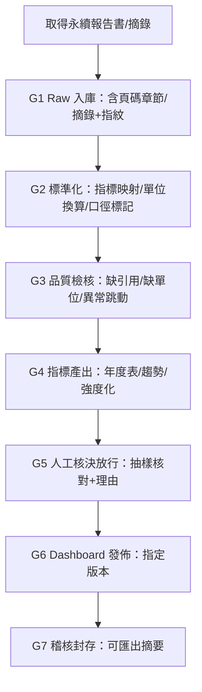

# 流程｜永續分析

本流程採共同 Gate（docs/core/04）。

```mermaid
flowchart TD
  A[取得永續報告書/摘錄] --> B[G1 Raw 入庫：含頁碼章節/摘錄+指紋]
  B --> C[G2 標準化：指標映射/單位換算/口徑標記]
  C --> D[G3 品質檢核：缺引用/缺單位/異常跳動]
  D --> E[G4 指標產出：年度表/趨勢/強度化]
  E --> F[G5 人工核決放行：抽樣核對+理由]
  F --> G[G6 Dashboard 發佈：指定版本]
  G --> H[G7 稽核封存：可匯出摘要]
```
流程要點

沒有來源引用的指標：卡在 G3 或 G5，不允許發佈

強度化必須先確認分母來源與版本；缺分母就不產出

多口徑不靠「選一個」解決，靠標記與並列呈現

---

