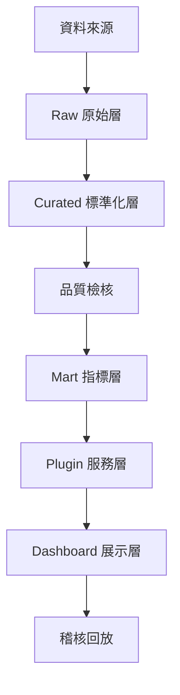

# 共同架構總覽

本系統用同一套治理底層，支援兩個分析功能（財報、永續），並確保每個 Dashboard 數字都能追溯到來源與核決紀錄。

## 1. 共同架構（E2E）

## 2. 分層責任

Raw：保留原貌與來源引用，只新增不覆寫

Curated：統一口徑（單位/幣別/期間/映射），新增版本不覆寫

品質檢核：產生可追溯的檢核結果，決定是否可進入指標層

Mart：產出可展示的指標與趨勢，每次重算產新版本

Plugin：提供可控查詢入口，回傳結果＋追溯資訊

Dashboard：只展示不做核心計算，缺值顯示缺

稽核回放：從任何輸出回推「來源/版本/公式/核決」

## 3. 核心治理概念（四件套）

版本（Version）：資料版本、指標版本、公式版本

指紋（Fingerprint）：內容指紋，不可變更

證據包（Evidence Pack）：來源＋指紋＋版本＋核決

Gate（Stage Gate）：每個放行點要留檢核證據

具體規格見：

core/02（資料核決與版本化）

core/03（證據包與稽核回放）

core/04（Gate 放行）

core/05（權限與 RLS）
